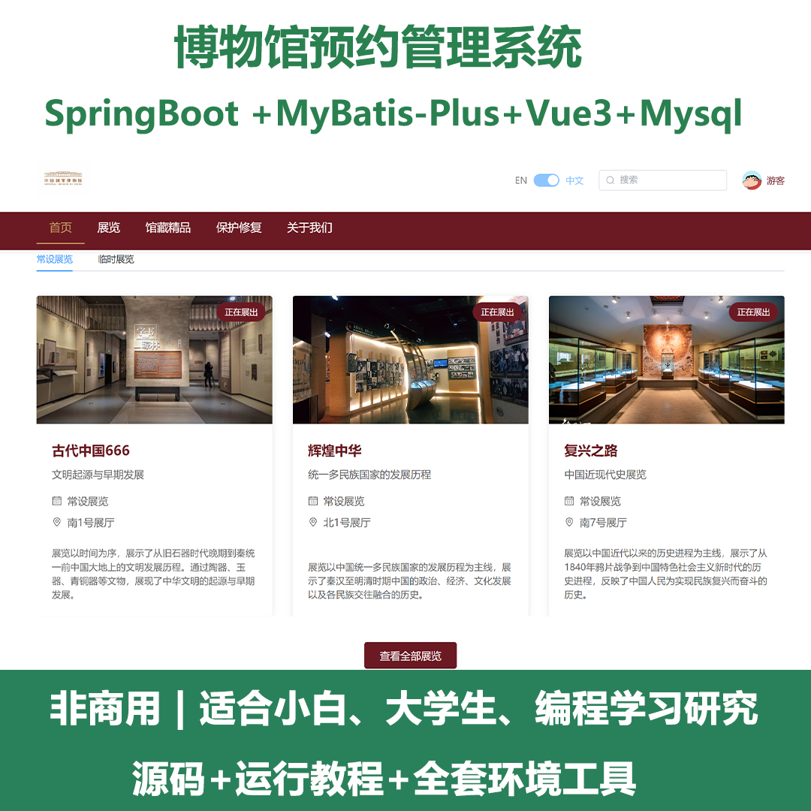
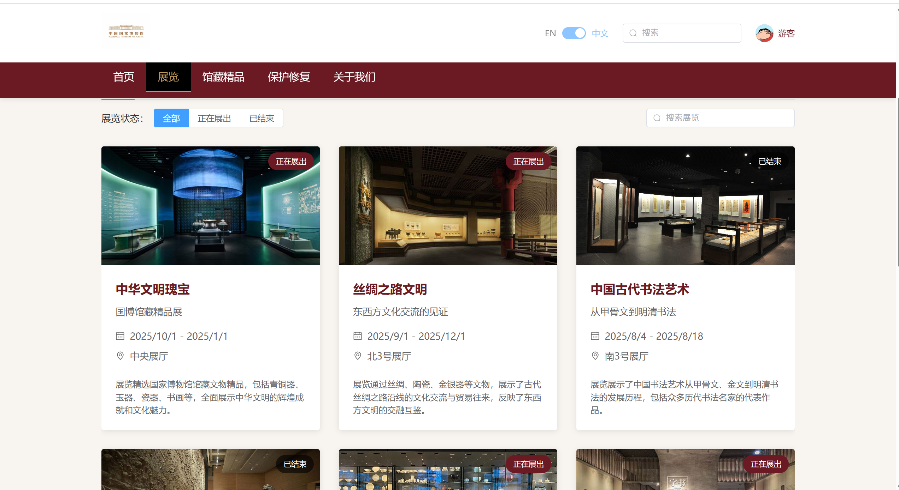
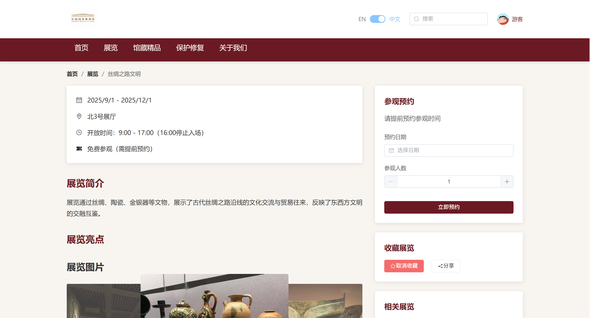
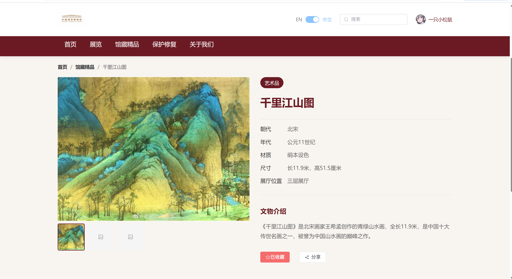
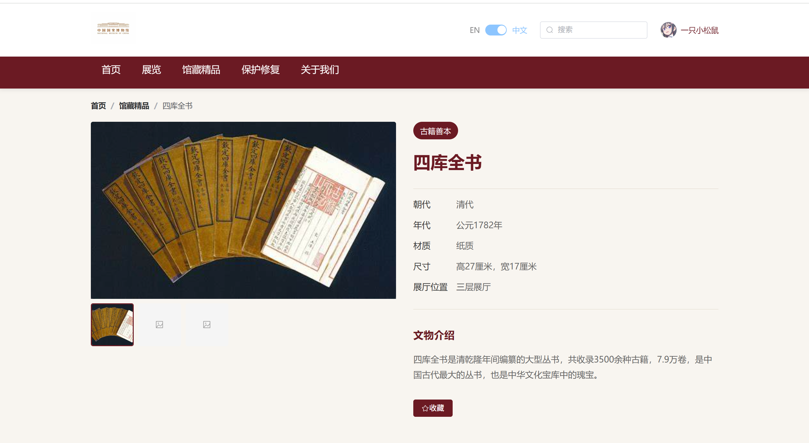
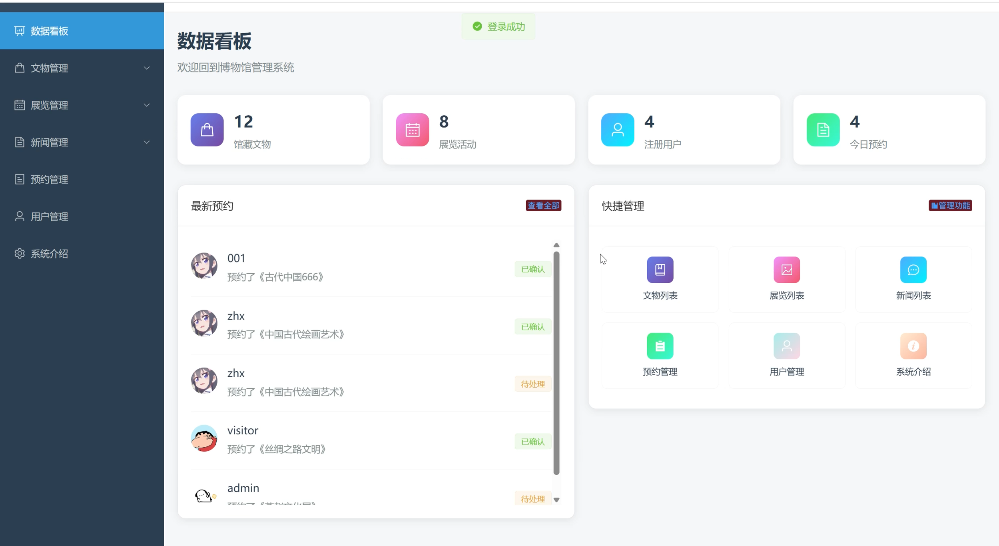
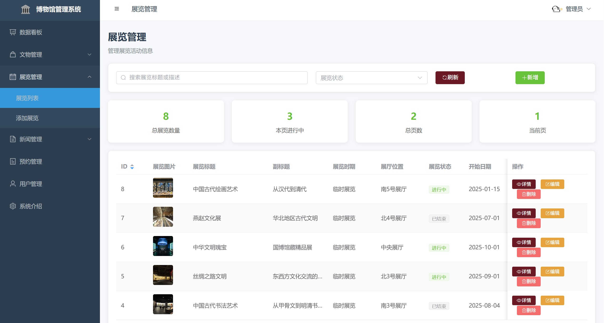
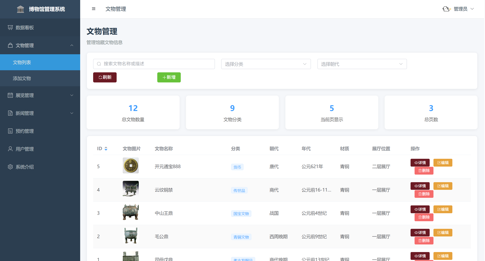
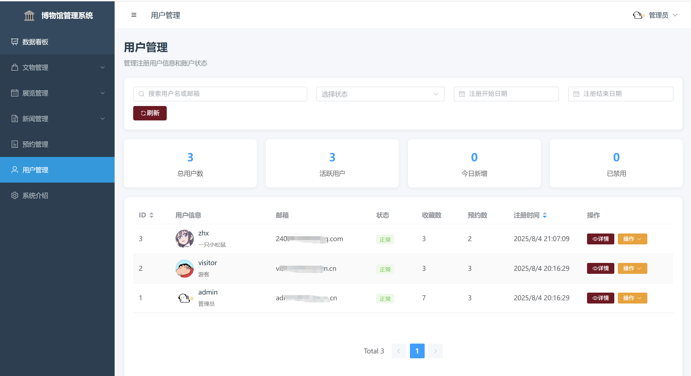

# springbootA533
springbootA533博物馆预约管理系统（Vue3）
 
## 查看主页获取源码

### 一、关键词

博物馆预约管理系统，博物馆系统

### 二、作品包含

源码+数据库+全套环境和工具资源+部署教程

### 三、项目技术

前端技术：Vue3 + Element Plus + Axios + Pinia + Sass
数据库：MySQL
后端技术：Java、SpringBoot + MyBatis-Plus + JWT

  

### 四、运行环境(以下版本亲测，其他版本未知，请自测)

开发工具：IDEA/eclipse  + vscode

数据库：MySQL8 

数据库管理工具：Navicat10以上版本

环境配置软件： JDK17 + Maven3.6.3

前端Nodejs：18

浏览器：谷歌浏览器

### 五、项目介绍

项目编号：springbootA533

本项目是一个基于Vue3和SpringBoot的前后端分离博物馆管理系统，提供文物展示、展览管理、用户收藏、展览预约等功能。系统采用现代化的技术栈，具备完整的用户管理体系和丰富的业务功能。

主要功能
- 用户注册/登录/个人中心管理
- 文物浏览、搜索、分类筛选
- 展览信息展示与在线预约
- 用户收藏系统（文物/展览）
- 新闻资讯浏览（列表/详情/分类筛选）
- **管理员数据看板**（实时统计数据、最新预约、快捷管理）
- **完整的管理后台**（文物管理、展览管理、用户管理、预约管理、新闻管理）

### 六、运行截图

